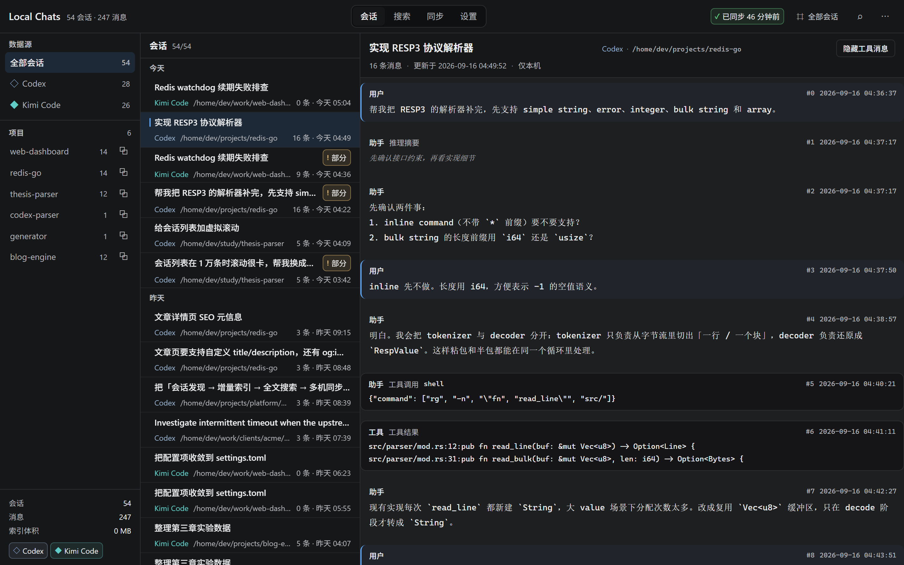

# Local AI Chat Manager

> 一个轻量、高性能、Local-first 的 AI Coding 会话管理客户端。
> 自动发现、索引、搜索本机 **OpenAI Codex** 与 **Kimi Code CLI** 的历史会话，并通过**独立的 Git 仓库**在多台电脑之间同步。

`Tauri 2` + `Rust` + `React` + `TypeScript` + `SQLite FTS5`

---

## 它解决什么问题

- 你在多台电脑上分别使用 Codex / Kimi Code；
- 两端都积累了大量本地会话历史（JSONL）；
- 你希望像管理代码一样用 Git 管理这些历史；
- 换电脑后一次同步，就能看到另一台电脑上的会话，并且可以全文搜索。

## 界面



> 截图使用的是合成演示数据（`npm run ui:demo` 一键生成：28 个虚构会话、6 个虚构项目，含长标题与空会话样本）。

左：数据源与项目筛选；中：按日期分组的会话列表（虚拟滚动）；右：会话内容（虚拟滚动 + 分页加载，工具消息可折叠）。

## 下载

到 [Releases](../../releases) 页面下载最新安装包（Windows）：

- `Local AI Chat Manager_<版本>_x64-setup.exe` — NSIS 安装程序（推荐）
- `Local AI Chat Manager_<版本>_x64_en-US.msi` — MSI 安装包

首次打开会自动探测 Codex / Kimi 数据目录并建立索引（数万条消息的全量解析约 1 分钟，之后增量毫秒级）。

## 多机同步设置

同步仓库是**你自己拥有的一个普通 Git 仓库**（GitHub / GitLab / Gitea / 自建均可），
应用只调用系统 `git`，不绑定任何平台 API、不需要自建服务器：

1. 在「设置 → 同步与隐私」选择一个本地空目录作为仓库（不存在会自动 `git init`）；
2. 填写远端地址（**强烈建议 Private 仓库**：AI 会话可能包含源代码与敏感信息）；
3. 认证完全交给系统 git：
   - **HTTPS 远端**：Windows 上 Git Credential Manager 会弹出浏览器授权一次，之后永久缓存，不需要任何密钥文件；
   - **SSH 远端**：把本机公钥（如 `~/.ssh/id_ed25519.pub`）添加到 GitHub → Settings → SSH Keys 即可；
4. 回到「同步」页点「立即同步」。

每台电脑只写自己 `<source>/<machine-id>/` 目录，结构上天然避免冲突；万一冲突，应用不自动合并、不丢任何一边。

## 核心特性

| 能力 | 说明 |
| --- | --- |
| 自动发现 | Codex：`CODEX_HOME` → `~/.codex`（递归找 `rollout-*.jsonl`）；Kimi：`KIMI_CODE_HOME` → `~/.kimi-code`；均支持手工指定目录 |
| 流式解析 | JSONL 逐行流式解析，单行损坏跳过并告警，100MB+ 会话不进内存 |
| 增量索引 | `size + mtime` 快速比对，变化后才算 BLAKE3；未变化会话零 IO |
| 全文搜索 | SQLite FTS5，100 万条消息下普通关键词 < 300ms（实测 p50 约 92ms） |
| Git 同步 | 只管理独立 Sync Repo，按机器分目录天然避免冲突；冲突不自动合并 |
| 历史归档 | 旧会话压缩为 `.tar.zst`（可选 gzip；真实会话实测约 2.3× 压缩比），随时恢复 |
| 原始文件只读 | Codex / Kimi 的 session 文件永不被修改；凭证类目录永不读取 |

## 快速开始

### 1. 环境要求

- Rust（stable）与 Cargo
- Node.js 20+
- 系统 `git`（同步功能需要）
- Windows：WebView2（Win11 自带；Win10 一般已内置）+ MSVC 生成工具（或 MinGW-w64，见下）
- macOS / Linux：系统 WebView 依赖（WKWebView / WebKitGTK）

### 2. 开发运行

```bash
npm install
npm run tauri:dev      # 启动桌面应用（前端热更新 + Rust 后端）
```

### 3. 打包

```bash
npx tauri build                    # 产出可执行文件 + 安装包（NSIS/MSI/DMG/AppImage…）
npx tauri build --bundles nsis     # 只出 Windows NSIS 安装包
npx tauri build --no-bundle        # 只要可执行文件
```

本机实测产物：

```text
target/release/local-ai-chat-manager.exe                      9.4 MB
target/release/bundle/nsis/Local AI Chat Manager_0.1.0_x64-setup.exe   3.1 MB
target/release/bundle/msi/Local AI Chat Manager_0.1.0_x64_en-US.msi      4.4 MB
```

> 直接用 cargo 构建生产版需要开启 `production` 特性（否则会尝试连接 dev 服务器）：
> `cargo build --release -p local-ai-chat-manager --features production`

### 4. 想先试用？用演示数据

```bash
python tools/make_demo_data.py C:/tmp/aichat-demo   # 生成合成演示数据（假项目 / 假会话）
# 然后在「设置」里把 Codex 目录指向 <目录>/codex-home、KimiCode 目录指向 <目录>/kimi-home
```

### 5. 无界面自检（推荐先跑一遍）

```bash
cargo run -p aichat-core --bin aichat-cli -- detect        # 探测数据源
cargo run -p aichat-core --bin aichat-cli -- scan          # 增量扫描并建索引
cargo run -p aichat-core --bin aichat-cli -- list --limit 10
cargo run -p aichat-core --bin aichat-cli -- search "lazy deletion"
```

<details>
<summary>Windows：没有 MSVC 时如何编译（MinGW-w64 方案，本仓库的发布产物就是这样构建的）</summary>

Tauri 官方推荐 MSVC 工具链。若机器上没有 Visual C++ 生成工具，可以用 MinGW-w64——
**NSIS/MSI 打包也实测可用**（v0.1.1 的发布产物即出自此路径）：

```bash
# 1) 安装 MinGW-w64（脚本从清华 TUNA 镜像拉取，无需管理员权限）
python tools/install_mingw.py            # 默认装到 C:/Users/<you>/tools/mingw64

# 2) 安装 GNU target 并用它构建（host 也必须用 gnu，否则 proc-macro 链接失败）
rustup toolchain install stable-x86_64-pc-windows-gnu

# Git Bash:
export PATH="/c/Users/<you>/tools/mingw64/mingw64/bin:$PATH"
export RUSTUP_TOOLCHAIN=stable-x86_64-pc-windows-gnu
cargo test -p aichat-core --target x86_64-pc-windows-gnu
npm run tauri build -- --target x86_64-pc-windows-gnu

# CMD/PowerShell 等价设置：
set PATH=C:\Users\<you>\tools\mingw64\mingw64\bin;%PATH%
set RUSTUP_TOOLCHAIN=stable-x86_64-pc-windows-gnu
```

注意两点：

- Git Bash 里 `/usr/bin/link.exe`（coreutils）会顶包 MSVC 的 `link.exe`，
  表现为 `link: extra operand ...`——用上面的 gnu 工具链即可绕开；
- 打包产物在 `target/x86_64-pc-windows-gnu/{debug,release}/bundle/`。
</details>

## 项目结构

```text
├── crates/aichat-core/      # 全部业务逻辑（不依赖 Tauri，可独立测试）
│   ├── src/adapters/        # Codex / Kimi / 同步仓库 三个 Adapter
│   ├── src/parser/          # JSONL 流式解析（容错）
│   ├── src/scanner/         # 增量扫描（指纹）+ 文件监听（debounce）
│   ├── src/storage/         # SQLite + FTS5 索引
│   ├── src/sync/            # Git 快照同步（命令封装、快照、编排）
│   ├── src/archive/         # zstd / gzip 归档
│   ├── src/bin/aichat_cli.rs# 命令行自检与性能测试
│   └── tests/               # 适配器 / 端到端 / 多机同步 集成测试
├── src-tauri/               # Tauri 2 外壳（IPC 命令、文件监听、插件）
├── src/                     # React 前端（会话 / 搜索 / 同步 / 设置）
├── tests/fixtures/          # 合成测试数据（含生成脚本）
└── docs/                    # 架构 / 适配器 / Git 同步 / 限制 / 路线图
```

## 文档

- [架构说明](docs/ARCHITECTURE.md) — 分层、数据流、性能设计与关键取舍
- [Adapter 说明](docs/ADAPTERS.md) — Codex / Kimi 真实文件格式与归一化规则
- [Git 同步说明](docs/GIT-SYNC.md) — 仓库结构、同步流程、多机与冲突处理
- [已知限制](docs/LIMITATIONS.md) — 明确不支持的场景与取舍
- [路线图](docs/ROADMAP.md) — 后续计划

## 安全与隐私

- **永不读取、永不复制、永不提交** `credentials/`、`token`、`auth.json`、私钥等敏感路径（代码中有硬性红线校验，并有测试覆盖）；
- AI 会话可能包含源代码、命令输出、内网地址与密钥，**请务必使用 Private 仓库**；
- 所有同步数据都由「复制 / 快照」产生，绝不修改 AI 工具自己的数据目录。

## 测试

```bash
cargo test -p aichat-core           # 单元 + 适配器 + 端到端 + 只读保证 + 多机 Git 同步
cargo run -p aichat-core --release --bin aichat-cli -- bench --sessions 10000 --messages 100
cargo run -p aichat-core --release --bin aichat-cli -- bench-session --size-mb 100
npm run typecheck && npm run build  # 前端类型检查与打包
```

## 验证结果（本机实测）

全部命令都在本机真实数据上跑过，输出如下（详见 [docs/LIMITATIONS.md](docs/LIMITATIONS.md) 的「性能边界」）：

```text
# 真实数据：336 个会话 / 80,256 条消息（Codex 191 + Kimi 142）
aichat-cli scan            → 解析 336，跳过 0，失败 0，索引 418 MB
                             （扫描期间每 8 个会话截断一次 WAL，磁盘峰值 42 MB）
aichat-cli scan（二次）     → 解析 0，跳过全部，耗时 ≈0.1 s          ← 增量：未变化不重解析
aichat-cli search "lazy deletion"  → 命中 3 条，耗时 3 ms
aichat-cli search "AGENTS.md"      → 命中 3 条，耗时 11 ms

# 归档压缩（真实会话 22.5 MB 样本）
zstd-3 → 9.9 MB（2.3×）；gzip-6 → 10.4 MB（2.2×）
  说明：会话 JSONL 含大量工具输出与 diff，熵高于纯文本，2.3× 是真实水平；
  归档的主要价值是冻结旧会话 + 缩小仓库，zstd 解压速度远快于 gzip。

# 合成数据：100 万条消息
aichat-cli bench --sessions 10000 --messages 100
  → 写入 1,000,000 条 43s（≈2.3 万条/秒），索引 249 MB
  → 搜索（单关键词命中 20 万条的极端情况）p50 288 ms / p95 305 ms

# 大会话：100 MB 单个 JSONL（181,668 条消息）
aichat-cli bench-session --size-mb 100
  → 解析 7.5s（13.4 MB/s），峰值内存 31 MB   ← 流式解析，不整体进内存

# 桌面应用（MinGW 工具链实测）
npm run tauri build -- --target x86_64-pc-windows-gnu
  → 产出 local-ai-chat-manager.exe + NSIS / MSI 安装包
  → 运行 exe：自动探测数据源、建立索引（336 会话 / 80,256 消息）、渲染完整界面

# 前端视觉与无障碍（截图 + 断言，见 docs/UI-QA.md）
npm run ui:qa                     → 横向溢出 / 嵌套滚动 / 焦点可达 / 大列表虚拟化
npm run ui:a11y                   → 深色与浅色主题的 WCAG AA 对比度审计
node tools/gallery_shot.mjs       → 组件画廊逐区块截图（组件级重设计的验收方式）

# 代码质量（规格 §31：每阶段都跑 formatter 与 lint）
cargo fmt --all -- --check        → 无格式差异
cargo clippy -p aichat-core --all-targets   → 0 warning
cargo clippy -p local-ai-chat-manager       → 0 warning
```

`cargo test -p aichat-core` 共 **41 个测试**：单元 28、Adapter 6、端到端 2、只读保证 2、
多机 Git 同步 2、搜索性能剖析 1。

## License

MIT
